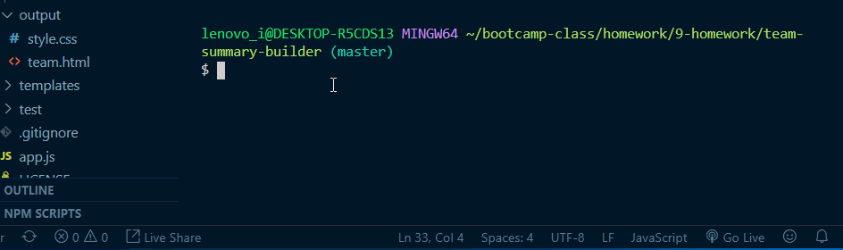
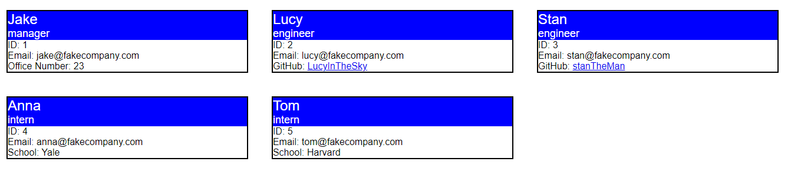
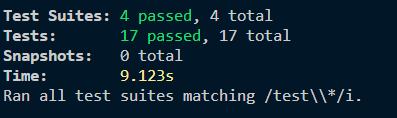

# team-summary-builder

## Description 
Node CLI app to create a project team based on prompts to the user and output an HTML file that shows the team and key information about the teammates.

## Images
GIF demonstrating the Node CLI in action. Checkout the output file for the actual output html.

Image of what the output HTML looks like opened in a chrome browers.

## Testing
Currently all tests provided in the homework are passing.

## Installation 
Keep all files in a single folder and do not move files around within the folder. You must also have node.js and perform a npm install to bring in all the necessary node modules. Run application using app.js as your node starting point.

## Usage 
This was primarily made to meet the requirements of a homework assignment. You could use this to as the basis of how to generate sn HTML to have an image of your full team and contact info for reference, or could modify it to create other diagrams of teams.

## Credits 
I created this code based on the homework prompt created by Triology Education Services. Certain pieces of code I used online resources for help. I have included citations in the form of comments throughout the html, javascript, and css.

## Contributing 
I was the only one to work on this project, but of course I had help from my instructor, TA's, and classmates.

## Challenges
The main challenges, other than using constructors and testing for the first time, was figuring out how to best organize my code. I am starting to reach a point that I almost have too many tools to choose from coding wise and it becomes challenging to decide which ones to choose and how to organize the code. In addition, testing and node.js coding was still tripping me up with minor syntax that I have not practiced often and continually caused errors.

## License
[MIT](https://choosealicense.com/licenses/mit/)
